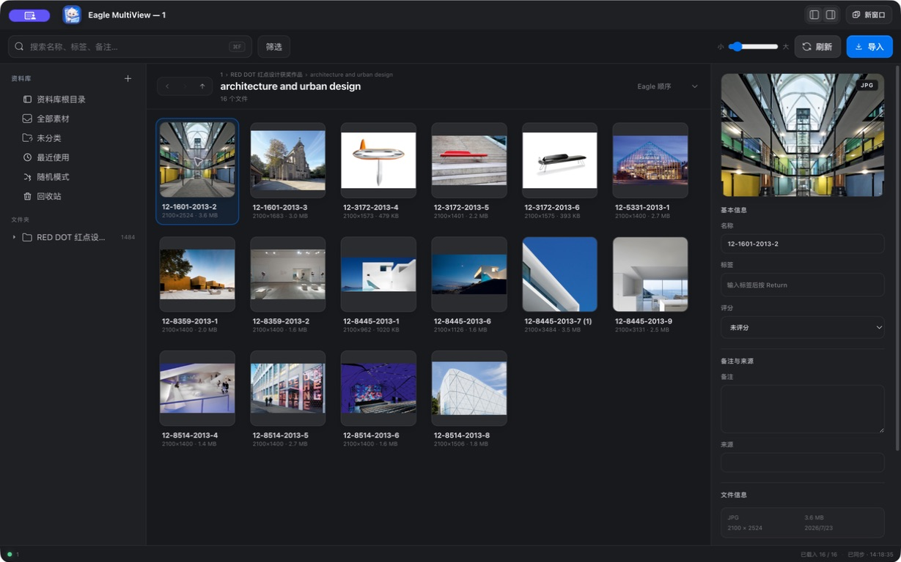
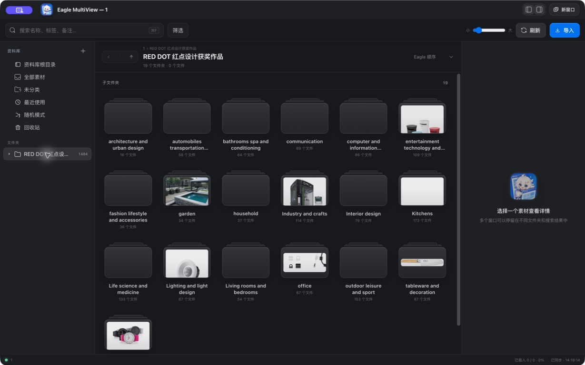
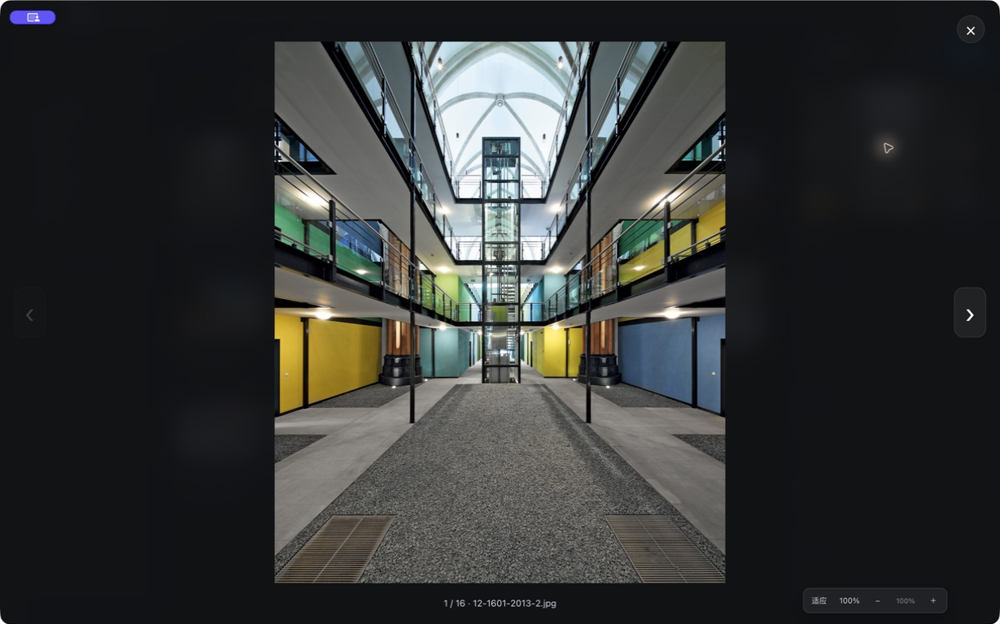

# Eagle MultiView

Eagle MultiView 是一个面向 macOS Eagle 4 用户的非官方多窗口伴侣。它让同一个 Eagle 资料库可以同时打开多个独立窗口，分别停留在不同文件夹、搜索结果或预览位置，适合整理大型参考图库、对照素材和跨目录工作。



> Eagle MultiView 不是 Eagle 官方产品，也不会启动第二个 Eagle 后台。Eagle 必须保持运行，MultiView 通过本机 Eagle HTTP API 读取和保存数据。

## 为什么需要它

Eagle 原生窗口适合集中整理，但在需要同时对照多个目录、分类和素材时，频繁来回切换会打断工作。MultiView 把每个窗口变成同一资料库的独立视图，同时共享选中素材的最新状态和写入结果。

## 主要功能

- 同一资料库可打开多个窗口，每个窗口独立浏览文件夹、搜索和筛选结果。
- Eagle 风格侧栏，包括最近使用、随机模式、回收站、快速访问、智能文件夹和真实文件夹树。
- 文件夹树默认收起；支持层级线、路径导航、文件夹卡片、双击进入和 `/` 展开/收起定位。
- 素材网格支持懒加载、连续滚动、键盘导航、缩略图大小调整和回到顶部。
- 图片支持适应窗口、实际大小、滚轮缩放和拖动查看；长图会完整适应可视区域。
- 支持 GIF、SVG、视频、音频、PDF 和 TXT 预览；TXT 可直接编辑并安全保存。
- Eagle 风格右键菜单支持打开、Finder 定位、复制路径、文件夹操作、标签、评分、置顶和回收站。
- 支持名称、标签、评分、备注、来源地址、批量标签和标签颜色管理。
- 支持文件选择、拖放、Finder 复制粘贴和剪贴板图片导入。
- 多窗口实时广播修改，并在保存前检查同字段冲突，避免旧数据覆盖新数据。



## 系统要求

- macOS 13 或更新版本。
- Apple silicon Mac（当前只发布 arm64 版本）。
- Eagle 4.0 Build 21 或更新版本。
- Eagle 需要先启动并打开一个可用资料库。

## 安装

1. 从 [GitHub Releases](https://github.com/khkjdfkjhdsfakhds/eagle-multiview/releases/latest) 下载 `Eagle-MultiView-1.5.1-arm64.dmg`。
2. 打开 DMG，将 Eagle MultiView 拖到“应用程序”。
3. 先启动 Eagle 并打开目标资料库，再启动 Eagle MultiView。
4. 点击右上角“新窗口”或按 `Command-N` 创建额外窗口。

当前版本使用临时本机签名，尚未经过 Apple 公证。macOS 首次拦截时，请在 Finder 中右键 Eagle MultiView 并选择“打开”；不需要关闭 Gatekeeper 或修改系统安全策略。

## 基本操作

| 操作 | 快捷键 |
| --- | --- |
| 新建 MultiView 窗口 | `Command-N` |
| 聚焦搜索 | `Command-F` |
| 导入文件 | `Command-Shift-O` |
| 预览 / 关闭预览 | `Space` |
| 进入文件夹 / 预览素材 | `Return` |
| 默认应用打开 | `Command-O` |
| 返回 / 前进 / 上一级 | `Option-Left` / `Option-Right` / `Option-Up` |
| 展开或收起当前文件夹树 | `/` |
| 显示或隐藏侧栏 | `Command-Shift-L` |
| 显示或隐藏检查器 | `Command-Shift-I` |
| 保存 TXT 或检查器修改 | `Command-S` |

## 数据安全

- 素材属性、文件夹归类、导入和回收站操作都交给 Eagle API，不直接重写 Eagle 的 `metadata.json`。
- MultiView 不提供永久删除；“移入回收站”仍可在 Eagle 中恢复。
- Eagle 切换资料库时，所有 MultiView 窗口会统一跟随，并清空旧库缓存和排队写入。
- 同一素材的写入按顺序执行；保存前会重新读取最新值并检查字段冲突。
- TXT 保存会检查外部修改，在 MultiView 自己的应用数据目录创建恢复备份后再原子替换。
- MultiView 自己的置顶和标签颜色状态保存在 Electron `userData` 中，不写入 Eagle 资料库。
- 应用不收集遥测，也不会把资料库内容上传到网络。

## 已知限制

- 依赖 Eagle 的本机 HTTP API，因此 Eagle 关闭或切换资料库期间编辑功能会暂时禁用。
- 资料库切换由 Eagle 本体决定，MultiView 不维护独立的资料库列表。
- 标签颜色和 MultiView 置顶是本地增强状态，不会显示在 Eagle 本体或其他电脑上。
- 插件管理、资料库修复/合并和永久删除仍需在 Eagle 中完成。
- 当前仅提供 Apple silicon macOS 构建，且未经过 Apple 公证。

## 演示素材说明

文档截图使用公开下载的 `RED DOT 红点设计获奖作品.eaglepack` 在独立测试资料库中生成，未使用维护者的个人资料库。素材包及其中图片不包含在仓库或发布包中，其版权归各自权利人所有；截图只用于展示应用界面和工作流程。



## 从源码运行

```sh
pnpm install
pnpm test
pnpm start
```

构建 Apple silicon macOS 安装包：

```sh
pnpm dist:mac
```

项目使用 Electron、原生 Node.js 和 Eagle HTTP API，没有网页服务端。

## 发布记录

完整变更见 [CHANGELOG.md](CHANGELOG.md)。

## 许可与第三方内容

项目代码以 MIT License 发布。Eagle 名称、商标及 `src/eagle-assets` 中用于界面对齐的 Eagle 图标不属于本项目，其权利归原权利人所有；详见 [THIRD_PARTY_NOTICES.md](THIRD_PARTY_NOTICES.md)。

## English summary

Eagle MultiView is an unofficial macOS multi-window companion for Eagle 4. It lets several independent windows browse the same Eagle library while keeping edits synchronized through Eagle's local HTTP API. The current release supports Apple silicon Macs only. Start Eagle first, open a library, then launch MultiView. No library content is uploaded, and metadata changes are routed through Eagle instead of rewriting its database files directly.
