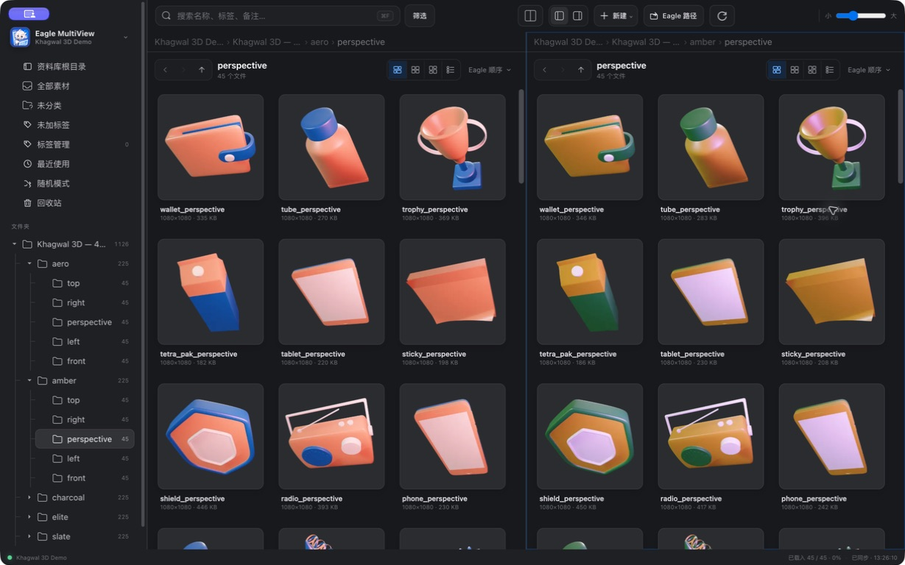
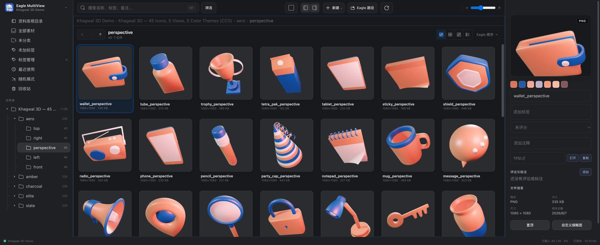
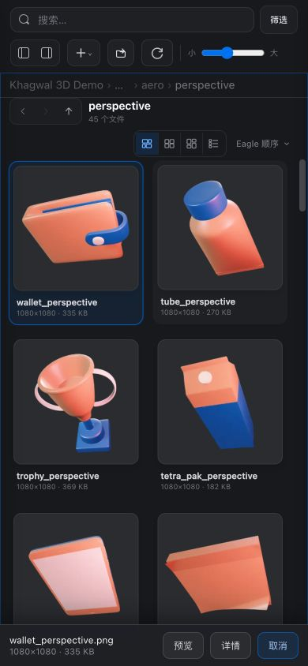
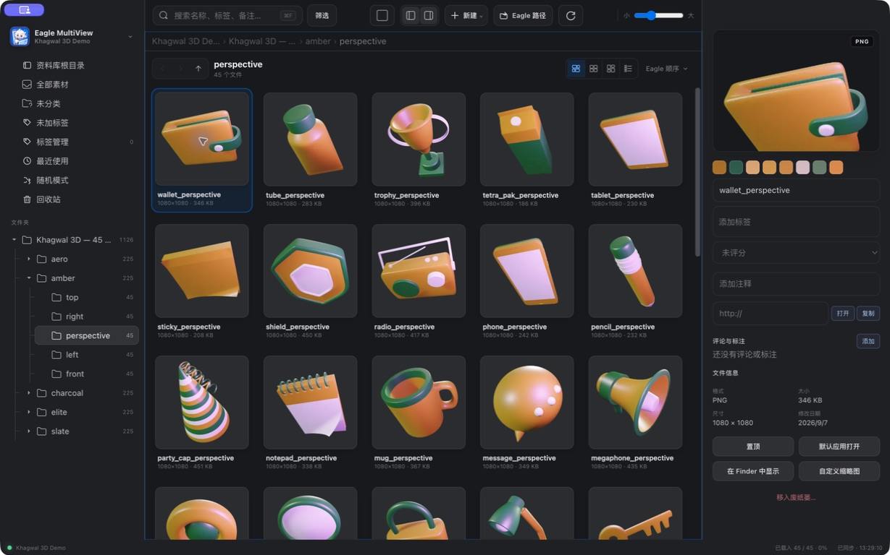
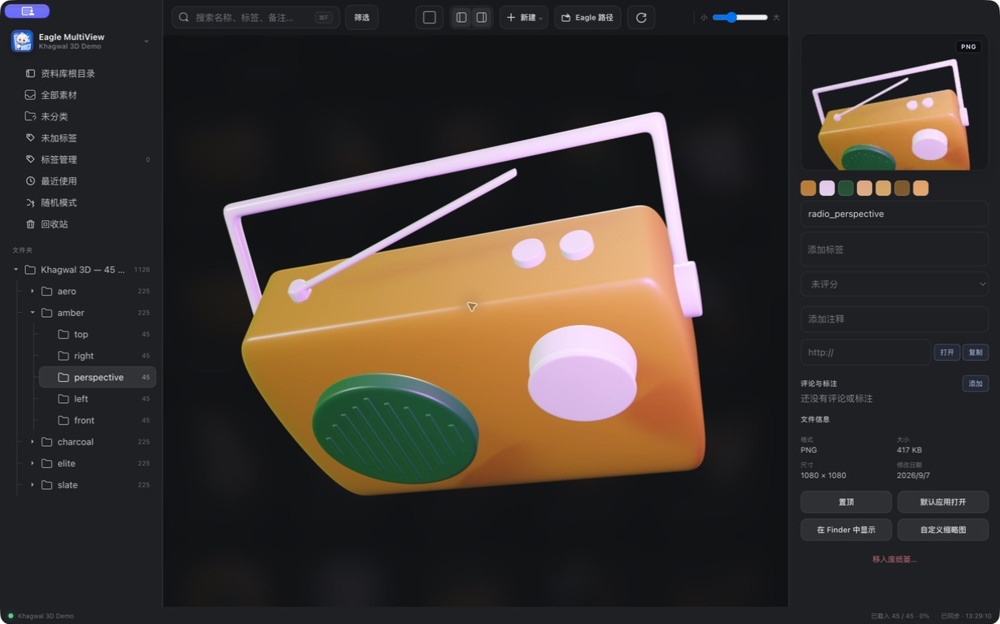

# Eagle MultiView

**在 Mac 上并排整理素材，在浏览器、手机和平板上继续使用同一个 Eagle 资料库。**

Eagle MultiView 是 Eagle 的非官方客户端，提供 **macOS 多窗口 / 多分栏工作区**和**内置局域网 Web 访问**。电脑端与网页端共享浏览、搜索、筛选、预览、整理和编辑流程，各视图独立导航，素材修改通过主机同步。

[下载 macOS 版](https://github.com/khkjdfkjhdsfakhds/eagle-multiview/releases/latest) · [手机与网页连接指南](#手机平板和网页端核心功能) · [1.8.0 更新说明](docs/release-notes-v1.8.0.md)



> Eagle MultiView 不是 Eagle 官方产品。使用时需要先启动 Eagle 并打开资料库；常规操作通过本机 Eagle HTTP API，TXT 正文保存通过配套的 Eagle 官方 Plugin API 后台服务。

当前版本：**1.8.0**。桌面安装包仅提供 **macOS Apple silicon**；从本版起停止构建和维护 Windows 桌面版。Windows 电脑仍可作为普通浏览器访问 Mac 主机。手机浏览器无需安装 Eagle 或额外客户端。

## 手机、平板和网页端：核心功能

在 Mac 上打开 Eagle 和 MultiView 后，手机、平板或另一台电脑就能通过浏览器连接这台 Mac，使用它当前打开的 Eagle 资料库。素材保存在主机上，无需先把整个资料库复制到移动设备，也不需要注册 MultiView 云端账号。

### 如何连接

1. 在 Mac 上启动 Eagle，打开目标资料库，再启动 Eagle MultiView。
2. 在 MultiView 菜单选择 **显示 → Web 访问…**，启用服务并保存。默认端口为 `41600`。
3. 让手机或另一台电脑与 Mac 连接同一局域网，扫描窗口中的地址二维码，或在浏览器输入窗口提供的局域网地址。
4. 输入桌面窗口显示的访问密钥，即可进入资料库。二维码用于打开地址；启用密钥验证时仍需登录。
5. 保持 Eagle、MultiView 和 Mac 运行；主机睡眠、退出或网络断开时，远端连接会中断。

浏览器支持时，可以使用“添加到主屏幕”入口。项目提供 Web App manifest 和移动端布局；能否以独立应用形式安装取决于浏览器和连接协议，普通局域网 HTTP 不保证所有 PWA 能力。

### 在手机上能做什么

| 场景 | 可用操作 |
| --- | --- |
| 找素材 | 浏览层级文件夹、搜索、标签/评分/格式/颜色等筛选、切换网格/瀑布流/列表 |
| 看素材 | 图片与支持格式预览、手势切图、缩放查看、连续浏览 |
| 整理素材 | 长按打开菜单、多选、标签与评分、备注、文件夹归类 |
| 传素材 | 从设备文件选择器上传；把选中的主机素材下载到当前设备 |
| 连续工作 | 下拉刷新、双指调整缩略图大小、底部选择栏、窄屏分栏纵向排列 |
| 跨设备协作 | 接收主机修改广播；断线恢复后重新同步，编辑保留冲突检查 |



<p align="center"></p>

手机图为桌面浏览器的移动尺寸演示，不代表 iPhone、Android 真机的全部兼容性验收。

### 连接与平台边界

- Web 服务默认关闭，默认启用访问密钥。重置密钥会使已有会话失效；服务也提供免密选项，仅适合你信任的网络。
- 内置服务使用 HTTP，密钥验证不等于传输加密。按局域网用途使用，不要直接把端口映射到公网。
- 浏览器端支持上传和下载；Finder 定位、原生文件拖出、系统默认应用打开等操作属于 Mac 桌面端。
- HTTP 或剪贴板权限受限时，复制会显示可选中的原文，供手动复制；媒体预览取决于浏览器的格式支持。
- Web TXT 保存同样需要主机启用[配套 TXT 后台插件](eagle-plugin/text-save-service/README.md)。
- 仓库另含 [Android 客户端外壳源码](android/README.md)，用于连接同一 Web 主机；本次发布不提供 Android 安装包，日常移动访问直接使用浏览器。

## 适合做什么

你可以让不同窗口或分栏分别停留在不同文件夹、搜索结果、筛选结果和预览位置，用来并排对照素材、跨目录整理大型资料库、批量归类、编辑信息和连续预览。各视图保持独立导航状态，同时共享最新的素材修改结果。还可以开启内置 Web 访问，在局域网内通过手机和平板直接浏览与整理资料库。

## 主要功能

- **多窗口与多分栏工作区**：同一资料库可打开多个独立窗口，单窗口内支持单栏、双栏、三栏或四栏布局；分栏同步仅联动全屏预览，网格滚动、选择和整理操作保持各栏独立，双击分割线即可重置比例。手机窄屏将多栏纵向排列，可上下滚动切换分栏；回到宽屏后恢复原布局和比例。
- **多种视图模式**：支持自适应网格、瀑布流 (Waterfall) 与详细列表 (List) 视图，每个分栏独立记忆视图模式；列表视图清晰展示标签、评分与添加日期。
- **Eagle 风格侧栏与资料库切换**：包含最近使用、随机模式、回收站、快速访问、智能文件夹和真实文件夹树；支持侧栏直接切换 Eagle 资料库。
- **层级文件夹与路径导航**：文件夹树层级清晰，支持顶部路径面包屑导航、文件夹卡片、双击进入和 `/` 展开/收起定位。
- **跨栏定位与统一刷新**：素材、文件夹和当前路径可通过右键在其他窗格显示；工具栏可一次刷新所有分栏。各分栏保留自己的路径、搜索、选择与滚动位置。
- **高级筛选与色彩搜索**：支持主色调色彩筛选（可直接在检查器色板中 Option-点击筛选）、文件大小、分辨率尺寸、添加日期范围筛选与单字段精准搜索。
- **素材整理与高效交互**：
  - 框选橡皮筋工具（空白处拖拽框选素材，支持边缘自动滚动）；
  - `Option` 拖拽素材直接移动归类（自动移出原文件夹）；
  - 快捷键 `0-5` 快速设置评分并展示卡片星级，`F2` 快捷重命名；
  - 检查器属性自动静默保存（失焦或停顿即时写入），Eagle 风格标签建议浮窗与颜色管理。
- **强大预览与媒体扩展**：
  - 支持图片、GIF、SVG、视频、音频、PDF 和 TXT 预览；TXT 输入停顿后后台保存，草稿与版本备份独立保留；
  - 支持相机 RAW 格式（CR2/CR3/NEF/ARW/DNG/ORF/RAF/RW2 等）及 PSD/TIFF/HEIC 高清预览；
  - 幻灯片放映模式（自定义轮播间隔）；
  - 预览背景切换（棋盘格/黑/白/无）与一键灰度模式；
  - 预览键盘方向导航与源网格几何位置严格对齐。
- **Web 访问与移动端适配**：内置 Web 服务与 PWA 支持，同一局域网下手机/平板扫码即可访问，支持触控手势（下拉刷新、双指缩放、滑动手势切图、长按菜单、底部选择栏）及跨设备下载与素材上传。
- **文件夹移动与手动排列**：移动文件夹本身、拖动排列当前列表中的文件夹和素材；手动顺序保存于 MultiView 本地，不改写 Eagle 本体排序。
- **缩略图维护与站点导入**：刷新缩略图、从文件或剪贴板设置自定义缩略图；ArtStation 作者主页分批发现作品，挑选后导入，并处理重复与部分失败。
- **AI 生成信息读取**：识别常见 NovelAI、Stable Diffusion WebUI、ComfyUI、InvokeAI 元数据；支持 WebP 内嵌 EXIF，NovelAI 全局与角色正面提示词分段展示、独立复制。是否可读取取决于原图是否保留相应数据。
- **预览同步快捷操作**：`Shift-S` 切换分栏全屏预览同步，显示自动淡出的状态提示；不联动普通网格的滚动、选择和整理。
- **安全与稳定性**：多窗口实时广播修改与字段级冲突检查；网格虚拟化渲染 (`content-visibility`)；滚动位置记忆；错误日志自动落盘。



## 系统要求

- macOS 13 或更新版本，Apple silicon Mac（主要支持和验证平台）。
- Eagle 4.0 Build 21 或更新版本。
- Eagle 需要先启动并打开一个可用资料库。

## 安装

### macOS

1. 从 [GitHub Releases](https://github.com/khkjdfkjhdsfakhds/eagle-multiview/releases/latest) 下载当前 macOS Apple silicon DMG。
2. 打开 DMG，将 Eagle MultiView 拖到“应用程序”。
3. 先启动 Eagle 并打开目标资料库，再启动 Eagle MultiView。
4. 按 `Command-Option-N`，或使用“文件”菜单创建额外窗口；从工具栏分栏按钮选择布局。
5. 如需编辑并保存 TXT 正文，按[后台保存插件说明](eagle-plugin/text-save-service/README.md)加载 App 随附的 Eagle 插件。普通浏览不需要该插件。

当前版本使用临时本机签名，尚未经过 Apple 公证。macOS 首次拦截时，请在 Finder 中右键 Eagle MultiView 并选择“打开”；不需要关闭 Gatekeeper 或修改系统安全策略。

## 基本操作

| 操作 | 快捷键 |
| --- | --- |
| 新建 MultiView 窗口 | `Command-Option-N` |
| 新建文件夹 | `Option-N` |
| 新建 TXT | `Option-Shift-N` |
| 聚焦搜索 | `Command-F` |
| 导入文件 | `Command-Shift-O` |
| 预览 / 关闭预览 | `Space` |
| 进入文件夹 / 预览素材 | `Return` |
| 快捷重命名 | `F2` |
| 快速评分 (0-5 星) | `0` ~ `5` |
| 在新窗口打开所选素材或文件夹 | `Command-O` |
| 默认应用打开 | `Shift-Return` |
| 返回 / 前进 / 上一级 | `Option-Left` / `Option-Right` / `Option-Up` |
| 展开或收起当前文件夹树 | `/` |
| 显示或隐藏侧栏 | `Command-Shift-L` |
| 显示或隐藏检查器 | `Command-Shift-I` |
| 保存 TXT | `Command-S` |
| 缩略图放大 / 缩小 / 重置 | `Command-+` / `Command--` / `Command-0` |
| 切换分栏全屏预览同步 | `Shift-S` |

## 数据安全

Web 下载会先核验选择与原文件，每次最多 500 项、合计 3.5GB；超限或存在缺失原文件时不开始下载，并提示调整选择后重试。“已开始下载”只表示已交给浏览器，下载完成与传输错误请查看浏览器下载列表。普通 HTTP 或浏览器拒绝剪贴板权限时，复制入口会显示可选中的原文，按系统复制命令完成后再确认“已手动复制”。

- 素材属性、文件夹归类、导入和回收站操作都交给 Eagle API，不直接重写 Eagle 的 `metadata.json`。
- MultiView 不提供永久删除；“移入回收站”仍可在 Eagle 中恢复。
- Eagle 切换资料库时，所有 MultiView 窗口会统一跟随，并清空旧库缓存和排队写入。
- 同一素材的写入按顺序执行；保存前会重新读取最新值并检查字段冲突。
- TXT 按资料库/素材串行检查内容版本，在自身数据目录保存草稿、暂存和备份，然后由 Eagle 官方后台插件 `Item.replaceFile()` 提交；没有直接写资料库的回退。每个素材保留最近 20 个不同正文的恢复备份。
- TXT 自动保存不主动打开、选择或激活 Eagle 窗口；缩略图刷新待确认与正文写入完成分别反馈。插件缺失、冲突、断连或不确定结果时保留草稿，不盲目重放；重新打开素材可显式恢复其他编辑会话的草稿。
- 当前 Eagle SDK 不接受零字节正文；清空后的文本作为草稿保留并明确提示，不填入空格伪装保存成功。外部 Eagle 的写入/切库接口没有跨应用原子版本锁，不承诺消除所有外部竞态。
- MultiView 自己的置顶、排序偏好和标签颜色状态保存在 Electron `userData` 中，不写入 Eagle 资料库。
- 应用不收集遥测，局域网 Web 访问默认关闭，需要手动开启。

## 已知限制

- 依赖 Eagle 的本机 HTTP API，因此 Eagle 关闭或切换资料库期间编辑功能会暂时禁用。
- 资料库切换由 Eagle 本体决定，MultiView 不维护独立的资料库列表。
- 标签颜色、排序记忆和 MultiView 置顶是本地增强状态，不会显示在 Eagle 本体或其他电脑上。
- 插件管理、资料库修复/合并和永久删除仍需在 Eagle 中完成。
- macOS 构建未经过 Apple 公证。
- 不再提供 Windows 桌面构建，旧 Release 中的实验安装包仅作历史存档。
- “取消自定义缩略图”暂缺受支持接口；刷新缩略图不等于恢复原始封面。ArtStation 导入受站点可访问性和返回内容限制，并非通用网页抓取器。

## 演示素材说明

本页 1.8.0 截图来自独立的 **Khagwal 3D Demo** 演示库，素材包下载自 [Eagle Community](https://community-en.eagle.cool/resource/khagwal-3d-illustrations)，作者为 [Nitish Khagwal](https://3d.khagwal.com/)，原作品采用 CC0 Public Domain License。只提交界面截图，不将素材包、演示资料库或个人资料库打包到仓库和安装包中。来源与旧截图说明见 [THIRD_PARTY_NOTICES.md](THIRD_PARTY_NOTICES.md)。



## 从源码运行

```sh
pnpm install
pnpm test
pnpm start
```

构建 Apple silicon macOS 安装包：

```sh
pnpm dist:mac
```

项目桌面端基于 Electron 与原生 Node.js 构建，通过 Eagle HTTP API 交互；可选的 Web 访问服务基于 Node.js 原生 HTTP/WebSocket 模块运行。

## 发布记录

完整变更见 [CHANGELOG.md](CHANGELOG.md)。

## 许可与第三方内容

项目代码以 MIT License 发布。Eagle 名称、商标及 `src/eagle-assets` 中用于界面对齐的 Eagle 图标不属于本项目，其权利归原权利人所有；详见 [THIRD_PARTY_NOTICES.md](THIRD_PARTY_NOTICES.md)。

## English summary

Eagle MultiView is an unofficial Eagle client for **Apple silicon macOS and local-network browsers**. Keep independent windows and up to four panes on your Mac, then browse, search, preview, organize, upload and download assets from a phone, tablet or another computer. Enable **View → Web Access** on the Mac, open its LAN address on the other device and sign in with the access key. Eagle and MultiView must remain running on the host. No cloud account or full-library copy is required. The built-in server uses HTTP and is intended for trusted local networks.

Version 1.8.0 adds folder moves, local manual ordering, thumbnail tools, selective ArtStation imports, safer TXT background saving, WebP/NovelAI character metadata and improved pane workflows. TXT writes use the bundled Eagle Plugin API service; metadata changes use Eagle's HTTP API. Windows desktop builds are discontinued. Android shell source is available, while mobile browsers are the ready-to-use entry point.
