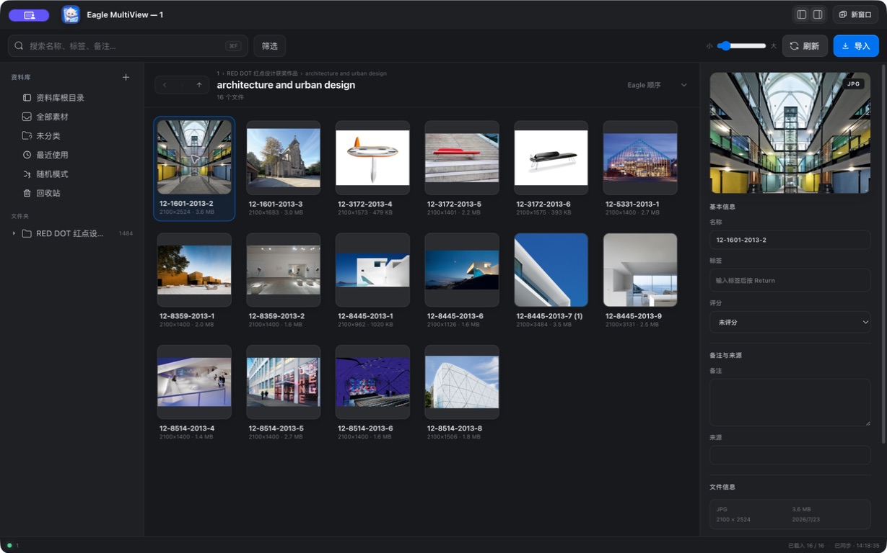
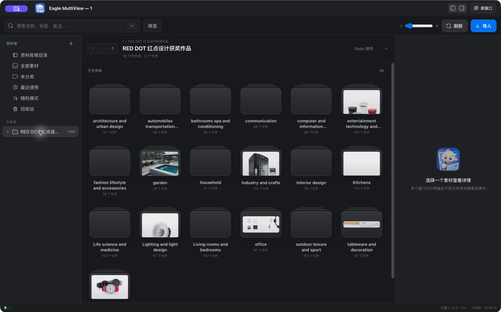
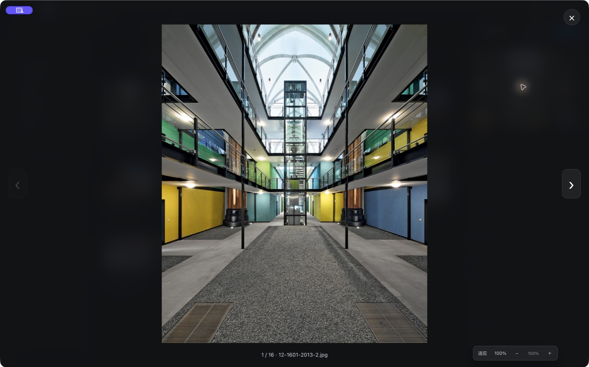

# Eagle MultiView

Eagle MultiView 是一个通过 Eagle 本地 HTTP API 工作的非官方多窗口客户端。它可以让同一个 Eagle 资料库同时在多个独立窗口和分栏中浏览、搜索、筛选、预览、整理、导入与编辑，并把修改同步到所有 MultiView 窗口。



> Eagle MultiView 不是 Eagle 官方产品。使用时需要先启动 Eagle 并打开资料库；MultiView 通过本机 Eagle HTTP API 读取和保存数据。

## 适合做什么

你可以让不同窗口或分栏分别停留在不同文件夹、搜索结果、筛选结果和预览位置，用来并排对照素材、跨目录整理大型资料库、批量归类、编辑信息和连续预览。各视图保持独立导航状态，同时共享最新的素材修改结果。还可以开启内置 Web 访问，在局域网内通过手机和平板直接浏览与整理资料库。

## 主要功能

- **多窗口与多分栏工作区**：同一资料库可打开多个独立窗口，单窗口内支持单栏、双栏、三栏或四栏布局；支持多分栏联动同步（同步滚动、翻页、预览与打分），双击分割线即可重置比例。
- **多种视图模式**：支持自适应网格、瀑布流 (Waterfall) 与详细列表 (List) 视图，每个分栏独立记忆视图模式；列表视图清晰展示标签、评分与添加日期。
- **Eagle 风格侧栏与资料库切换**：包含最近使用、随机模式、回收站、快速访问、智能文件夹和真实文件夹树；支持侧栏直接切换 Eagle 资料库。
- **层级文件夹与路径导航**：文件夹树层级清晰，支持顶部路径面包屑导航、文件夹卡片、双击进入和 `/` 展开/收起定位。
- **高级筛选与色彩搜索**：支持主色调色彩筛选（可直接在检查器色板中 Option-点击筛选）、文件大小、分辨率尺寸、添加日期范围筛选与单字段精准搜索。
- **素材整理与高效交互**：
  - 框选橡皮筋工具（空白处拖拽框选素材，支持边缘自动滚动）；
  - `Option` 拖拽素材直接移动归类（自动移出原文件夹）；
  - 快捷键 `0-5` 快速设置评分并展示卡片星级，`F2` 快捷重命名；
  - 检查器属性自动静默保存（失焦或停顿即时写入），Eagle 风格标签建议浮窗与颜色管理。
- **强大预览与媒体扩展**：
  - 支持图片、GIF、SVG、视频、音频、PDF 和 TXT 预览；TXT 可直接编辑并安全备份保存；
  - 支持相机 RAW 格式（CR2/CR3/NEF/ARW/DNG/ORF/RAF/RW2 等）及 PSD/TIFF/HEIC 高清预览；
  - 幻灯片放映模式（自定义轮播间隔）；
  - 预览背景切换（棋盘格/黑/白/无）与一键灰度模式；
  - 预览键盘方向导航与源网格几何位置严格对齐。
- **Web 访问与移动端适配**：内置 Web 服务与 PWA 支持，同一局域网下手机/平板扫码即可访问，支持触控手势（下拉刷新、双指缩放、滑动手势切图、长按菜单、底部选择栏）及跨设备下载与素材上传。
- **安全与稳定性**：多窗口实时广播修改与字段级冲突检查；网格虚拟化渲染 (`content-visibility`)；滚动位置记忆；错误日志自动落盘。



## 系统要求

- macOS 13 或更新版本，Apple silicon Mac（主要支持和验证平台）。
- Windows 10/11 x64（实验性构建，见下方说明）。
- Eagle 4.0 Build 21 或更新版本。
- Eagle 需要先启动并打开一个可用资料库。

## 安装

### macOS

1. 从 [GitHub Releases](https://github.com/khkjdfkjhdsfakhds/eagle-multiview/releases/latest) 下载 `Eagle-MultiView-1.6.0-arm64.dmg`。
2. 打开 DMG，将 Eagle MultiView 拖到“应用程序”。
3. 先启动 Eagle 并打开目标资料库，再启动 Eagle MultiView。
4. 点击右上角“新窗口”或按 `Command-Option-N` 创建额外窗口。

当前版本使用临时本机签名，尚未经过 Apple 公证。macOS 首次拦截时，请在 Finder 中右键 Eagle MultiView 并选择“打开”；不需要关闭 Gatekeeper 或修改系统安全策略。

### Windows（实验性）

从同一 Release 下载 `Eagle-MultiView-1.6.0-Setup.exe`。这个安装包是根据当前源码生成的 Windows x64 实验性版本，未进行 Windows 代码签名，**未完成 Windows 实机 GUI 回归，后续不承诺兼容性修复、更新或维护**。Windows 用户应自行评估后使用；主要功能仍依赖本机正在运行的 Eagle 及其 HTTP API。

## 基本操作

| 操作 | 快捷键 |
| --- | --- |
| 新建 MultiView 窗口 | `Command-Option-N` |
| 新建文件夹 | `Option-N` |
| 新建 TXT | `Option-Shift-N` |
| 聚焦搜索 | `Command-F` |
| 导入文件 | `Command-Shift-O` |
| 预览 / 关闭预览 | `Space` |
| 进入文件夹 / 预览素材 | `Return` |
| 快捷重命名 | `F2` |
| 快速评分 (0-5 星) | `0` ~ `5` |
| 默认应用打开 | `Command-O` |
| 返回 / 前进 / 上一级 | `Option-Left` / `Option-Right` / `Option-Up` |
| 展开或收起当前文件夹树 | `/` |
| 显示或隐藏侧栏 | `Command-Shift-L` |
| 显示或隐藏检查器 | `Command-Shift-I` |
| 保存 TXT | `Command-S` |

## 数据安全

- 素材属性、文件夹归类、导入和回收站操作都交给 Eagle API，不直接重写 Eagle 的 `metadata.json`。
- MultiView 不提供永久删除；“移入回收站”仍可在 Eagle 中恢复。
- Eagle 切换资料库时，所有 MultiView 窗口会统一跟随，并清空旧库缓存和排队写入。
- 同一素材的写入按顺序执行；保存前会重新读取最新值并检查字段冲突。
- TXT 保存会检查外部修改，在 MultiView 自己的应用数据目录创建恢复备份后再原子替换。
- MultiView 自己的置顶、排序偏好和标签颜色状态保存在 Electron `userData` 中，不写入 Eagle 资料库。
- 应用不收集遥测，局域网 Web 访问默认关闭，需要手动开启。

## 已知限制

- 依赖 Eagle 的本机 HTTP API，因此 Eagle 关闭或切换资料库期间编辑功能会暂时禁用。
- 资料库切换由 Eagle 本体决定，MultiView 不维护独立的资料库列表。
- 标签颜色、排序记忆和 MultiView 置顶是本地增强状态，不会显示在 Eagle 本体或其他电脑上。
- 插件管理、资料库修复/合并和永久删除仍需在 Eagle 中完成。
- macOS 构建未经过 Apple 公证。
- Windows x64 仅按当前版本提供未签名的实验性安装包，不承诺后续维护；macOS 专属操作在 Windows 上可能不可用或行为不同。

## 演示素材说明

文档截图使用公开下载的 `RED DOT 红点设计获奖作品.eaglepack` 在独立测试资料库中生成，未使用维护者的个人资料库。素材包及其中图片不包含在仓库或发布包中，其版权归各自权利人所有；截图只用于展示应用界面和工作流程。



## 从源码运行

```sh
pnpm install
pnpm test
pnpm start
```

构建 Apple silicon macOS 安装包：

```sh
pnpm dist:mac
```

构建 Windows x64 实验性安装包：

```sh
pnpm dist:win
```

项目桌面端基于 Electron 与原生 Node.js 构建，通过 Eagle HTTP API 交互；可选的 Web 访问服务基于 Node.js 原生 HTTP/WebSocket 模块运行。

## 发布记录

完整变更见 [CHANGELOG.md](CHANGELOG.md)。

## 许可与第三方内容

项目代码以 MIT License 发布。Eagle 名称、商标及 `src/eagle-assets` 中用于界面对齐的 Eagle 图标不属于本项目，其权利归原权利人所有；详见 [THIRD_PARTY_NOTICES.md](THIRD_PARTY_NOTICES.md)。

## English summary

Eagle MultiView is an unofficial multi-window client for Eagle 4. It can browse, search, filter, preview, organize, import, and edit one Eagle library across independent windows, multi-pane layouts, and local-network mobile browsers while synchronizing changes through Eagle's local HTTP API. Apple silicon macOS is the primary supported platform. A Windows x64 build is provided as an untested experimental artifact without a maintenance commitment. No library content is uploaded, and metadata changes are routed through Eagle instead of rewriting its database files directly.
